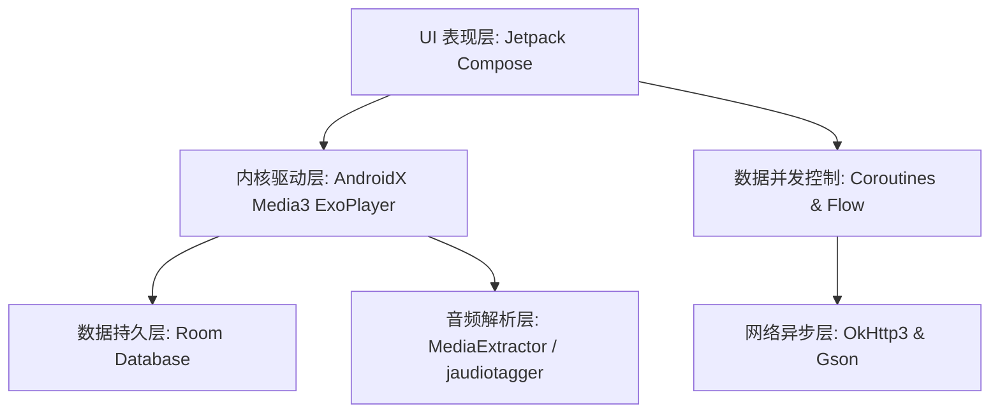

<div align="center">
  <h1>🌌 Auralis (音澜)</h1>
  <p><b>发烧级本地高保真无损音乐播放器 · 基于 Kotlin & Jetpack Compose</b></p>
  <p><i>彻底接管“解码”到“输出”全链路，释放本地无损音乐最真实的生命力</i></p>

[](https://developer.android.com)
[](https://kotlinlang.org)
[](https://developer.android.com/jetpack/compose)
[](https://developer.android.com/media/media3)
[](LICENSE)
</div>

---

## 💡 项目愿景

**Auralis 音澜** 的使命是打破 Android 底层音频接口的传统妥协。针对原生系统元数据高频错报、AudioFlinger 强制混音 SRC 劣化的通病，项目从零构建了自适应源码直通引擎与双层防抖缓存架构。不仅在技术层面上攻克了高频切歌下的时序竞争乱象，更在视觉层面上将声明式流体美学与硬核发烧工作台完美结合。

---

## ✨ 核心特性 (Key Features)

### 🔊 终极听觉引擎 (Audiophile Engine)
* **🔌 全局自适应 USB 源码直通 (Dynamic Bit-Perfect Output)**
  彻底绕过 Android 系统的 AudioFlinger 混音器。深度适配 Android 14+ 规范，实时抓取底层数据库真值（如 24bit/192kHz），并与外接 USB DAC 进行最高规格的“硬件握手”，点亮全屏金标，拒绝 SRC 劣化。
* **🛠️ 突破系统限制的“真值”解析 (True-Bit Extraction)**
  不再受限于系统 `MediaMetadataRetriever` 经常错报 48kHz 的通病。深度结合 `MediaExtractor` 与底层数据库（`jaudiotagger`），精准挖掘并展现真实的母带级采样率与位深。
* **⚡ 全新 Media3 驱动与 Offload 硬件卸载**
  全面拥抱新一代播放内核。完美支持高码率 FLAC/WAV/DSD 的超大内存防卡顿缓冲，并在非直通状态下智能开启 `Audio Offload`，实现丝滑的无缝播放与极致省电。

### ☁️ 云端智能与元数据 (Cloud Intelligence)
* **🌊 三级瀑布流智能封面引擎 (Waterfall Cloud-Meta)**
  无惧残缺的本地元数据。优先获取 Apple Music (iTunes) API 的 `800x800` 顶级无损原图，网易云音乐 API 无缝兜底，自研极光流体算法渲染终极防线。
* **🎤 全网双擎滚动歌词 (Dual-Engine Synced Lyrics)**
  网易云 API 优先，酷狗音乐无缝降级。在线抓取后强制压缩为 `.webp` 与 `.lrc` 永久持久化至本地缓存，一次联网，终身离线秒开。

### ⚡ 工业级性能架构 (Industrial Performance)
* **🚄 双层防抖缓存引擎 (Ultra-Fast Caching)**
  内置自研 `AudioCache` 单例。采用 `LruCache` (RAM) + 磁盘静态文件双层缓存。智能过滤系统虚构的脏图，通过 `RGB_565` 强效节省 50% 内存。即使面对上千首无损曲库，列表滚动依然绝对丝滑。
* **🛡️ 强悍的双赛道并发防御 (Dual-Track Concurrency)**
  在毫秒级的快速切歌中，彻底消灭时序竞争乱象（Race Condition）。采用协程作用域斩杀机制配合 `500ms` 智能防抖，彻底杜绝歌词串台、接口风控与脏数据写入。

### 🎨 现代发烧级美学 (Aesthetic Interface)
* **🎛️ 沉浸式发烧工作台 (Audiophile Dashboard)**
  全面重构大圆角、毛玻璃与半透明呼吸感 (Glassmorphism) 的全屏设置与播放界面。内置 ReplayGain 动态响度平衡、专业五频段 EQ 均衡器与 A-B 循环硬核功能。
* **🏆 发烧级音质分级与专属配色 (Audiophile Tagging)**
  严苛的音质漏斗算法。从 DSD、DXD 到 Master、Hi-Res+。为顶级格式定制了兼顾深色/浅色模式的高对比度 UI 标签（如 DSD 的“母带深橙”，Hi-Res 的“发烧金黄”）。
* **📊 极客级详细信息面板 (Geek-Level Info)**
  一键查看硬核音频档案：编码格式、动态回放增益 (ReplayGain)、空间音频声道检测 (Spatial Audio/AV3A 12声道)、文件修改时间以及精准的听歌足迹记录。

---

## 🛠️ 技术栈 (Tech Stack)



* **UI 框架**: Jetpack Compose 100% 纯声明式构建 (Material Design 3)
* **内核驱动**: AndroidX Media3 (ExoPlayer 内核)
* **音频解析**: `MediaExtractor`, `MediaMetadataRetriever`, `jaudiotagger`
* **异步并发**: Kotlin Coroutines & Flow (自适应切换 `Dispatchers.IO` / `Main`)
* **本地存储**: Room Database (基于破坏性迁移策略升级多张关联表)
* **网络请求**: OkHttp3 (15s 超时拉长防断链路) & Gson

---

## 🚀 核心架构亮点 (Architecture Highlights)

Auralis 重点解决了传统 Android 音视频开发中长期存在的两大痛点：**底层数据源污染** 与 **高频异步读写竞争**。

### 1. 零 IO 浪费的“单次扫描行为”

在传统架构中，读取音频规格、提取缩略图、查询本地数据库往往会导致多次磁盘 IO。Auralis 在深度扫描过程中：

* 仅触发**一次物理 IO 操作**，利用 `jaudiotagger` 与 `MediaExtractor` 异步泵出物理位深、真实采样率与内嵌 Meta 标签。
* 扫描数据直接通过 Room 进行冲突忽略 (`OnConflictStrategy.IGNORE`) 入库，从源头拯救系统索引被污染的“真值”。

### 2. 协程作用域斩杀机制防御时序竞争

用户高频切歌或快速滚动列表时，会瞬间并发数十个网络封面/歌词查询请求。

* Auralis 充分利用了 Compose `LaunchedEffect` 的 Key 值联动机制，一旦 `audioPath` 变更，上一个未完成的独立请求赛道将被**瞬间强行 cancel 斩杀**。
* 核心写入逻辑配备 `Mutex` 互斥锁，即使网络回流存在延迟，也严格拒绝脏数据和串台歌词写入当前物理磁盘。

---

## 🎹 发烧级隐藏玩法：PC 有线音箱推流模式

Auralis 内部集成了基于低延迟 `AudioTrack (PERFORMANCE_MODE_LOW_LATENCY)` 构建的 Socket 接收端，可将手机转化为 PC 的有线无损发烧外置声卡：

1. 进入 App 「设置」 $\rightarrow$ 打开 **PC 有线音箱模式**（服务将自动探测并监听 `8899` 端口）。
2. 将手机通过数据线连接至电脑，确保 **USB 调试** 已激活。
3. 在电脑端控制台运行 adb 逆向端口转发命令：
```bash
adb reverse tcp:8899 tcp:8899

```


4. 电脑端声卡推流服务开启后，音频流将通过有线链路以 44.1kHz/16bit 双声道 PCM 无损泵入手机，实现几乎零延迟的推流同步体验。

---

## 📜 许可证 (License)

本项目采用 [GNU GPLv3](https://github.com/Rueded/AURALIS/edit/master/LISENCE) 许可证开源，一切底层改动及优化必须保持开源。

```
