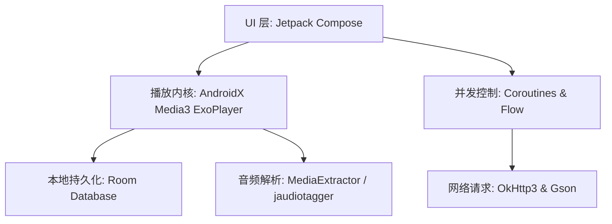

<div align="center">
  <h1>🌌 A U R A L I S 音澜</h1>
  <p><b>基于 Kotlin & Jetpack Compose 的本地无损音乐播放器</b></p>
  <p>专注于准确的音频信息展示与稳定的本地播放体验</p>

[](https://developer.android.com)
[](https://kotlinlang.org)
[](https://developer.android.com/jetpack/compose)
[](https://developer.android.com/media/media3)
[](LICENSE)

**[中文](#中文说明) · [English](#english)**
</div>

---

# 中文说明

## 项目简介

AURALIS 是一款基于 Media3 ExoPlayer 内核的本地音乐播放器，主要解决两个问题：Android 系统 API 在读取音频元数据（采样率、位深）时经常报不准，以及切歌频繁时网络请求（封面/歌词）容易产生竞态和脏数据。项目在这两点上做了针对性的工程处理，同时提供均衡器、歌词、封面主题色、频谱分析等常规播放器功能。

## 功能特性

### 播放内核
- 基于 AndroidX Media3 (ExoPlayer) 构建播放链路。
- **USB Bit-perfect 输出**：Android 14 (API 34) 及以上系统，使用官方开放的 `AudioMixerAttributes` API，将输出采样率/位深与源文件对齐，并结合 Media3 的 `AudioOffloadPreferences` 在非直通状态下启用硬件卸载播放，以降低功耗。低于 API 34 的设备不支持该特性，会走系统默认混音路径。
- 支持 FLAC / WAV / DSD 等格式播放。

### 准确的音频信息
- 系统自带的 `MediaMetadataRetriever` 在部分机型上会把高采样率文件误报为 48kHz。项目额外引入 `jaudiotagger` 在扫描阶段解析真实的采样率、位深，并写入本地数据库，播放时优先读取这份数据，而不是临时用系统 API 现读。
- 详情面板展示：格式、采样率、位深、声道数（含空间音频/AV3A 12 声道检测）、码率、ReplayGain 动态增益、文件大小、时长、播放次数、最近播放时间、修改时间、文件路径。所有标签均已接入字符串资源，支持中英文界面。

### 云端封面与歌词
- **封面**：并发请求 QQ 音乐、网易云、iTunes、Deezer 四个来源，取最先返回的有效结果，不做质量分级或图像合成。
- **歌词**：支持网易云 / QQ 音乐 / 酷狗 / LRCLIB 多个来源，可在设置中调整优先级顺序；抓取结果会压缩为本地 `.lrc` 文件缓存，避免重复请求。

### 性能与并发处理
- 扫描曲库时合并 IO：一次遍历中同时完成音频规格解析（`jaudiotagger` / `MediaExtractor`）与元数据入库（Room，`OnConflictStrategy.IGNORE`），减少重复磁盘读取。
- 封面/缩略图使用 `LruCache`（内存）+ 磁盘文件的两级缓存，位图统一使用 `RGB_565` 而非默认的 `ARGB_8888`，在牺牲部分色彩精度的前提下降低约一半内存占用。
- 快速切歌时，借助 Compose `LaunchedEffect` 的 key 机制取消上一首歌曲未完成的网络请求（封面/歌词），并配合 500ms 防抖与 `Mutex` 互斥写入，避免异步结果乱序覆盖当前歌曲的数据。

### 均衡器
- 基于 Android 系统的 `Equalizer` / `BassBoost` / `LoudnessEnhancer`（`android.media.audiofx`）音频效果器实现，提供五段 EQ、低音增强和响度增强，并支持 ReplayGain 动态响度平衡。这是系统级音频效果，不是自研 DSP 算法。
- 若开启 USB 源码直通，音频将不经过系统混音器，此时均衡器无法生效，界面会提示“均衡器已旁路”。

### 频谱与无损鉴定（实验性功能）
- 使用 `MediaExtractor` + `MediaCodec` 硬解码，在歌曲约 1/3 时间点截取 20 秒 PCM 数据，混合双声道并做浮点归一化。
- 对采样帧施加汉宁窗后做 2048 点 FFT，统计各频段能量，找到平均能量高于 -65dB 阈值的最高频率作为“截止频率”估计值。
- 依据截止频率给出参考判定（如“接近奈奎斯特频率，疑似无损”或“截止频率偏低，疑似低码率转码”），并渲染频谱热力图。
- 需要说明：这是基于经验阈值的启发式判断，用于辅助参考，**不是**权威的音频取证工具，可能受编码器、低通滤波设置等因素影响产生误判。

### PC 有线音频推流（局域网/USB 调试功能）
基于 `AudioTrack`（`PERFORMANCE_MODE_LOW_LATENCY`）实现的 Socket 接收端，可以把手机当作电脑的一个有线音频输出设备：

1. App「设置」→ 打开「PC 有线音箱模式」，服务会监听 `8899` 端口。
2. 手机通过数据线连接电脑，确保已开启 USB 调试。
3. 电脑端执行端口转发：
   ```bash
   adb reverse tcp:8899 tcp:8899
   ```
4. 电脑端的推流程序建立连接后，会以 44.1kHz / 16bit 双声道 PCM 格式通过该端口发送音频数据，手机端播放。这是一个基础的本地 Socket 传输方案，延迟表现取决于数据线连接质量和电脑端实现，并非硬件级无损声卡。

## 技术栈


```mermaid
graph TD
    A[UI 层: Jetpack Compose] --> B[播放内核: AndroidX Media3 ExoPlayer]
    B --> C[本地持久化: Room Database]
    A --> D[并发控制: Coroutines & Flow]
    B --> E[音频解析: MediaExtractor / jaudiotagger]
    D --> F[网络请求: OkHttp3 & Gson]
```

- **UI**：Jetpack Compose（Material Design 3），声明式构建
- **播放内核**：AndroidX Media3 (ExoPlayer)
- **音频解析**：`MediaExtractor`、`MediaMetadataRetriever`、`jaudiotagger`
- **并发**：Kotlin Coroutines & Flow
- **本地存储**：Room Database（当前使用 `fallbackToDestructiveMigration`，意味着数据库结构升级时旧数据会被清空重建，非增量迁移，升级前请注意备份）
- **网络请求**：OkHttp3、Gson
- **信号处理**：自实现的 2048 点 FFT、汉宁窗加权，用于频谱分析

## 架构说明

**曲库扫描**：传统实现容易在读取规格、缩略图、写库时产生多次磁盘 IO。AURALIS 在扫描阶段将 `jaudiotagger` 解析结果与 `MediaExtractor` 提取结果合并为一次写入，通过 `OnConflictStrategy.IGNORE` 入库。

**并发安全**：切歌、快速滚动列表会触发多个封面/歌词请求。项目利用 Compose `LaunchedEffect` 的 key 联动机制，在 `audioPath` 变化时取消上一个未完成的请求协程，写入逻辑加 `Mutex` 锁，防止网络延迟回包时写入了已经不是当前播放歌曲的数据。

## 已知局限

- USB Bit-perfect 依赖 Android 14+ 系统 API，旧系统不支持。
- 频谱鉴定为启发式估算，不能替代专业音频分析工具。
- 封面/歌词接口均为第三方公开接口，非官方授权，可能因对方接口变更而失效。
- Room 数据库使用破坏性迁移，版本升级会清空本地数据表。

## 许可证

本项目采用 [GNU GPLv3](https://github.com/Rueded/AURALIS/blob/master/LICENSE) 许可证开源。

---

# English

## Overview

AURALIS is a local music player built on the Media3 ExoPlayer engine. It mainly addresses two practical problems: Android's system APIs often misreport audio metadata (sample rate, bit depth), and frequent track switching can cause race conditions in network requests (cover art / lyrics) that lead to stale data being written. Beyond that, it's a fairly standard player with an equalizer, lyrics, cover-driven theming, and a spectrum analyzer.

## Features

### Playback core
- Built on AndroidX Media3 (ExoPlayer).
- **USB bit-perfect output**: on Android 14 (API 34) and above, the app uses the official `AudioMixerAttributes` API to match the output sample rate/bit depth to the source file, and falls back to Media3's `AudioOffloadPreferences` for hardware offload playback (to save power) when passthrough isn't active. Devices below API 34 fall back to the standard system mixing path.
- Supports FLAC / WAV / DSD and other lossless formats.

### Accurate audio metadata
- `MediaMetadataRetriever` misreports high-sample-rate files as 48kHz on some devices. The app additionally uses `jaudiotagger` during library scanning to read the real sample rate and bit depth, storing them in the local database so playback reads from that rather than re-querying the system API each time.
- The detail panel shows: format, sample rate, bit depth, channel count (including spatial audio / AV3A 12-channel detection), bitrate, ReplayGain, file size, duration, play count, last played time, modified time, and file path — all labels are localized via string resources (Chinese/English).

### Cover art & lyrics
- **Cover art**: fetches concurrently from QQ Music, NetEase, iTunes, and Deezer, and uses whichever valid result comes back first. No quality ranking or image compositing involved.
- **Lyrics**: supports NetEase / QQ Music / KuGou / LRCLIB, with a configurable source priority in settings. Fetched lyrics are cached locally as `.lrc` files to avoid repeat requests.

### Performance & concurrency
- Library scanning merges audio-spec parsing (`jaudiotagger` / `MediaExtractor`) and database writes (Room, `OnConflictStrategy.IGNORE`) into a single pass to reduce redundant disk IO.
- Covers/thumbnails use a two-tier cache: `LruCache` (memory) plus disk files, with bitmaps stored as `RGB_565` instead of the default `ARGB_8888` — roughly halves memory usage at the cost of some color precision.
- On rapid track switching, Compose `LaunchedEffect`'s key mechanism cancels the previous track's in-flight requests (cover/lyrics), combined with a 500ms debounce and a `Mutex` around writes, to prevent out-of-order async responses from overwriting the currently playing track's data.

### Equalizer
- Built on Android's system `Equalizer` / `BassBoost` / `LoudnessEnhancer` (`android.media.audiofx`) audio effects — a 5-band EQ, bass boost, and loudness enhancement, plus ReplayGain-based loudness normalization. This is the standard system-level audio effects stack, not a custom DSP implementation.
- When USB bit-perfect passthrough is active, audio bypasses the system mixer entirely, so the equalizer can't apply — the UI shows "Equalizer bypassed" in that case.

### Spectrogram & lossless check (experimental)
- Uses `MediaExtractor` + `MediaCodec` hardware decoding to extract ~20 seconds of PCM data around the 1/3 mark of a track, downmixing channels and normalizing to float.
- Applies a Hann window and a 2048-point FFT per frame, then finds the highest frequency bin whose average energy exceeds a -65dB threshold, used as an estimated cutoff frequency.
- Based on that cutoff, the app shows a reference verdict (e.g. "near Nyquist frequency, likely lossless" or "cutoff is low, possibly transcoded from lossy") along with a rendered spectrum heatmap.
- Important caveat: this is a heuristic based on a fixed threshold, meant as a rough indicator — **not** an authoritative audio forensics tool. Encoder settings and low-pass filtering choices can produce false positives/negatives.

### PC wired audio streaming (LAN/USB debugging feature)
A socket receiver built on `AudioTrack` (`PERFORMANCE_MODE_LOW_LATENCY`) that lets the phone act as a wired audio output for a PC:

1. In the app's Settings, enable "PC Wired Speaker Mode" — this starts a listener on port `8899`.
2. Connect the phone to the PC via USB with USB debugging enabled.
3. On the PC, run:
   ```bash
   adb reverse tcp:8899 tcp:8899
   ```
4. Once the PC-side streaming tool connects, it sends 44.1kHz/16-bit stereo PCM over that socket for the phone to play. This is a basic local socket transport — latency depends on the cable connection and the PC-side implementation, not a hardware-grade lossless sound card.

## Tech stack

- **UI**: Jetpack Compose (Material Design 3), fully declarative
- **Playback core**: AndroidX Media3 (ExoPlayer)
- **Audio parsing**: `MediaExtractor`, `MediaMetadataRetriever`, `jaudiotagger`
- **Concurrency**: Kotlin Coroutines & Flow
- **Local storage**: Room Database (currently uses `fallbackToDestructiveMigration`, meaning schema upgrades wipe and recreate tables rather than migrating incrementally — back up data before upgrading)
- **Networking**: OkHttp3, Gson
- **Signal processing**: hand-rolled 2048-point FFT with Hann windowing, used for spectrum analysis

## Known limitations

- USB bit-perfect requires Android 14+; unsupported on older systems.
- The lossless check is a heuristic estimate, not a substitute for proper audio analysis tools.
- Cover art and lyrics rely on unofficial third-party public endpoints, which may break if those services change.
- Room uses destructive migration, so a schema version bump clears local tables.

## License

Licensed under [GNU GPLv3](https://github.com/Rueded/AURALIS/blob/master/LICENSE).
